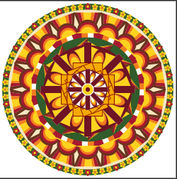

# 🌸 Mehjebin Nasar's Pookalam 2026 🌸

## 👨‍💻 About Me
- **Name:** Mehjebin Nasar
- **Institution/Company:** MES College of Engineering and Technology (MESCET), Kunnukara
- **GitHub:** [@Mehjebin-Nasar](https://github.com/Mehjebin-Nasar)
- **Programming Language Used:** Python (Joy library)

## 🎨 My Pookalam

### Description
A radially symmetric digital pookalam built using the Joy graphics library in Python. The design layers concentric rings of floral petals, dotted borders, and a pinwheel-style center to capture the traditional look of an Onam floral carpet, entirely generated through code.

### Preview


### Features
- Fully radial, code-generated symmetry (no manual drawing)
- Layered concentric rings — petals, dotted border, and pinwheel core
- Traditional Onam color palette (maroon, mustard, green, cream)

## 🚀 How to Run

### Prerequisites
```bash
pip install joy
```

### Running the Code
```bash
python code_a_pookalam.py
```
Run in Google Colab or any Python environment with the Joy library installed.

## 🎊 Happy Onam! 🎊

Submitted for Code-a-Pookalam 2026 by TinkerHub RIT
